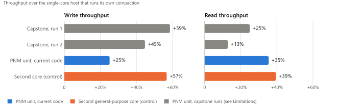

# Near-Data Processing for LSM-tree Compaction Acceleration

[](https://github.com/h23yonsei/gem5-pnm-lsm-compaction/actions/workflows/checks.yml)

A full-system study of offloading **RocksDB compaction** to a **Processing-Near-Memory (PNM)**
unit, evaluated on a modified **gem5** simulator. The project asks a single question: *if
LSM-tree compaction runs near memory instead of on the CPU, how much do foreground reads and
writes speed up?*

Offloading compaction to the PNM unit, against a single-core host that runs it itself:

| | [Capstone runs](#results) (two) | [Rerun with the current code](#results-with-the-current-code) |
|---|---:|---:|
| Write throughput | **+45% to +59%** | **+25%** |
| Read throughput | +13% to +25% | **+35%** |
| Core-0 L2 misses | **−54% to −64%** | −30% |

<picture>
  <source media="(prefers-color-scheme: dark)" srcset="figures/throughput-dark.svg">
  
</picture>

The capstone ran the same configuration twice. Its runs boot under KVM and are not
bit-reproducible, so the two give a range rather than a single figure, and three
[limitations](#limitations-of-the-capstone-runs) of how they were set up limit how far their
figures can be attributed to near-memory processing. The current code removes the first two and,
for the third, corrects the device model's units and adds a control run; its rerun is
deterministic. That control, a second general-purpose core, raises write throughput by 57%, at the
cost of a whole core; the PNM unit is meant to be a small engine in the DIMM's buffer chip. The
simulation models neither's area or power, but a [rough estimate](#area-and-power-estimate) puts
the unit at a tenth or less of the second core's caches alone. See
[The current code](#the-current-code).

Capstone project for Electrical Engineering Comprehensive Design (EEE4160) at Yonsei University,
Spring 2026, with Jaesik Jang. Written up as a paper:
[`paper/pnm-compaction-paper.pdf`](paper/pnm-compaction-paper.pdf). The paper, the committed
runs and every figure under [Results](#results) come from the code as submitted, tagged
[`capstone`](https://github.com/h23yonsei/gem5-pnm-lsm-compaction/tree/capstone).

**Division of work.** This repository is the full-system (FS mode) study, and all of the code in
it is mine: the PNM device model, the RocksDB compaction service and its IPC layer, the guest
kernel module and disk image, the gem5 upstream fixes, and the evaluation. Jaesik Jang worked on
a syscall-emulation (SE mode) variant of the same idea, which is not part of this repository.
The changes made after the capstone are mine alone.

---

## What was written for this project

The repository vendors gem5 and RocksDB, coupled by a small MMIO register map duplicated by hand in
[`pnm_compactor.hh`](gem5/src/dev/pnm/pnm_compactor.hh) and
[`pnm_compaction_service.h`](rocksdb/tools/pnm_compaction_service.h); one repository keeps that
contract in sync. **The project's own code is the 13 files below, about 1,900 lines, plus targeted
changes to twelve upstream files.** Everything else under `gem5/` and `rocksdb/` is upstream:

- `gem5/` is gem5 **v25.1.0.1**.
- `rocksdb/` is RocksDB **main at `e492562`** (2026-05-29, version 11.4.0), without 13 repository
  tooling files (agent instructions and review workflows) that the build does not use.

Every change to an upstream file is committed as a patch against those versions:
[`patches/gem5.patch`](patches/gem5.patch) and [`patches/rocksdb.patch`](patches/rocksdb.patch).

**The simulated hardware**: a new gem5 MMIO device.

| File | Lines | What it does |
|------|-------|--------------|
| [`gem5/src/dev/pnm/pnm_compactor.hh`](gem5/src/dev/pnm/pnm_compactor.hh) | 121 | Register map, class definition, stats |
| [`gem5/src/dev/pnm/pnm_compactor.cc`](gem5/src/dev/pnm/pnm_compactor.cc) | 246 | MMIO read/write, latency model, DMA result write |
| [`gem5/src/dev/pnm/PNMCompactor.py`](gem5/src/dev/pnm/PNMCompactor.py) | 83 | SimObject parameter wrapper |
| [`gem5/src/dev/pnm/SConscript`](gem5/src/dev/pnm/SConscript) | 7 | Build registration |

**The simulated software**: a RocksDB `CompactionService` that offloads jobs.

| File | Lines | What it does |
|------|-------|--------------|
| [`rocksdb/tools/pnm_compaction_service.h`](rocksdb/tools/pnm_compaction_service.h) | 228 | The offloading `CompactionService` implementation |
| [`rocksdb/tools/pnm_unit_main.cc`](rocksdb/tools/pnm_unit_main.cc) | 331 | `pnm_compaction_unit` worker process |
| [`rocksdb/tools/pnm_ipc.h`](rocksdb/tools/pnm_ipc.h) | 56 | Length-prefixed UNIX-socket framing |
| [`rocksdb/tools/db_bench_pnm_main.cc`](rocksdb/tools/db_bench_pnm_main.cc) | 100 | `db_bench` entry point with the service wired in |

**Bringing the two together**: full-system harness and guest driver.

| File | Lines | What it does |
|------|-------|--------------|
| [`gem5/configs/yonsei/run_pnm.py`](gem5/configs/yonsei/run_pnm.py) | 228 | PNM-offloaded full-system run |
| [`gem5/configs/yonsei/run_baseline.py`](gem5/configs/yonsei/run_baseline.py) | 202 | CPU-only control run |
| [`gem5/configs/yonsei/pnm_module.c`](gem5/configs/yonsei/pnm_module.c) | 121 | Guest kernel module exposing `/dev/pnm` |
| [`gem5/configs/yonsei/mount_disk_image.sh`](gem5/configs/yonsei/mount_disk_image.sh) | 144 | Builds the guest disk image |
| [`gem5/configs/yonsei/pnm_module.Makefile`](gem5/configs/yonsei/pnm_module.Makefile) | 9 | Kernel module build |

**Changes to upstream gem5** ([`patches/gem5.patch`](patches/gem5.patch)). Running two cores
through a KVM→TIMING switch with an MMIO device in the loop trips upstream assertions: packets
issued in the KVM phase reach the cache or interconnect in the TIMING phase already partly
converted to responses. No run completes without these fixes:

| File | Change |
|------|--------|
| `src/mem/cache/mshr.cc` | `needsWritable()` called on response packets in deferred MSHR targets |
| `src/mem/cache/base.cc` | Null `senderState`, evicted-block `LockedRMWWriteReq`, out-of-bounds stats indexing |
| `src/mem/cache/cache.cc` | Software-prefetch assert, uncacheable miss-latency stat, MSHR target response path |
| `src/mem/coherent_xbar.cc` | Assertion on orphan responses with no `routeTo` entry |
| `src/mem/bridge.cc` | x86 IO devices returning unconverted request packets from timing-response callbacks |
| `src/python/gem5/components/boards/kernel_disk_workload.py` | Guest command built from the argument list's repr instead of the arguments |
| `src/python/pybind11/event.cc`, `stats.cc` | `simulate()` releases the Python GIL; the stats dump/reset callbacks reacquire it |
| `.gitignore` | Ignores `disk_images/` and `core`; tracks `m5out/` |

Each gem5 fix is described (symptom, root cause and change) in
[`gem5/docs/GEM5_CUSTOMIZATIONS.md`](gem5/docs/GEM5_CUSTOMIZATIONS.md).

**Changes to upstream RocksDB** ([`patches/rocksdb.patch`](patches/rocksdb.patch)):
`tools/db_bench_tool.cc` gains the `--pnm_offload` and `--pnm_true_offload` flags,
`CMakeLists.txt` adds the `pnm_compaction_unit` and `rocksdb_pnm` targets, and
`db/db_impl/db_impl_secondary.h` makes `CompactWithoutInstallation()` public so the worker can
call it on a persistent secondary DB. See
[`gem5/docs/DB_BENCH_CUSTOMIZATION.md`](gem5/docs/DB_BENCH_CUSTOMIZATION.md).

---

## How it works

The design is a **hybrid functional + timing model**. gem5 accounts for *how long* near-memory
compaction would take; a real RocksDB worker process does the *actual* compaction on a separate
core, so its DRAM traffic and cache behavior are simulated faithfully without polluting the main
CPU's caches.

```text
  gem5 x86 full-system guest (2 cores, DualChannel DDR4-2400, 3 GiB)
  ┌──────────────────────────────────────────────────────────────────────────┐
  │                                                                          │
  │   core 0                               core 1                            │
  │  ┌──────────────────────┐    UNIX     ┌──────────────────────────────┐   │
  │  │  rocksdb_pnm         │   socket    │  pnm_compaction_unit         │   │
  │  │  (db_bench)          │ ──────────► │  (persistent secondary DB)   │   │
  │  │                      │  job input  │  CompactWithoutInstallation  │   │
  │  │  PNMCompactionSvc    │ ◄────────── │                              │   │
  │  └─────────┬────────────┘  job result └──────────────────────────────┘   │
  │            │ MMIO via /dev/pnm (pnm_module.ko)                           │
  │            ▼                                                             │
  │  ┌───────────────────────────────────────────────┐                       │
  │  │ PNMCompactor  (gem5 device @ 0xD0000000)      │  models latency =     │
  │  │  doorbell CMD_SUBMIT → STATUS_DONE after      │  (src+dst)/25GiB/s    │
  │  │  the modeled near-memory delay                │  + 500 ns             │
  │  └───────────────────────────────────────────────┘                       │
  └──────────────────────────────────────────────────────────────────────────┘
```

**Per compaction job:**

1. RocksDB schedules a compaction. `PNMCompactionService::Schedule()` serializes the job, sends it
   over a UNIX domain socket (`/tmp/pnm_compaction.sock`) to `pnm_compaction_unit`, and rings the
   gem5 doorbell by writing `CMD_SUBMIT` to the PNM device's MMIO register (through the
   `/dev/pnm` mapping provided by `pnm_module.ko`). The input files' total size goes in as both
   `src_bytes` and `dst_bytes`, since the output size is not known yet.
2. The gem5 `PNMCompactor` device models the near-memory cost,
   `(src_bytes + dst_bytes) / 25 GiB/s + 500 ns`, then raises `STATUS_DONE`.
3. Concurrently, `pnm_compaction_unit` performs the real compaction. It keeps a persistent
   secondary DB (`DB::OpenAsSecondary`) so the MANIFEST is parsed once; each job is just
   `TryCatchUpWithPrimary()` + `CompactWithoutInstallation()`.
4. When its compaction is done, the worker polls the device's `STATUS` until the modeled delay
   has also passed, then sends the result frame back over the socket. `PNMCompactionService::Wait()`
   blocks on that socket, and RocksDB installs the new SSTs.

**Core 1 stands in for the PNM unit.** It runs `pnm_compaction_unit` and nothing else, taking
compaction jobs in the background while the database runs on core 0, as a near-memory compaction
engine would. The hybrid model splits the unit in two: core 1 performs the merge, with its real
DRAM traffic, and the `PNMCompactor` device charges the latency the near-memory hardware would add.
What core 1 does not model is the hardware's placement: it is a host-class core, the same 3 GHz
TIMING CPU as core 0, with the same private 32 KiB L1 and 512 KiB L2 and the same path to DRAM
through the host's memory controller. The results therefore measure what moving compaction off the
host core onto a dedicated unit gives the host; what placing that unit in the DIMM would add, such
as its internal bandwidth or traffic that stays off the memory channel, is outside what this model
can show.

In the capstone runs, compaction ran in the worker beside the database, so **it did not compete
with the write thread for the baseline's single core**: that is where the write-side speedup comes
from, even though RocksDB's write-stall time is longer in the PNM runs. The capstone worker's output
SSTs were also smaller, because it compressed them (see
[Limitations](#limitations-of-the-capstone-runs)).

---

## Repository layout

```text
gem5-pnm-lsm-compaction/
├── README.md                          ← this file
├── patches/                           every change to upstream gem5 and RocksDB, as patches
├── tools/check_results.py             recomputes the README and paper figures from gem5/m5out/
├── tools/check_patches.sh             checks patches/ against the upstream versions
├── tools/area_power_estimate.py       the area and power estimate below
├── tools/plot_results.py              draws figures/ from gem5/m5out/
├── figures/                           the results figure, light and dark
├── paper/                             the write-up
│
├── gem5/                              modified gem5 simulator (v25.1.0.1)
│   ├── src/dev/pnm/                   PNMCompactor device (MMIO latency model)
│   │   ├── pnm_compactor.{hh,cc}      register map + timing model
│   │   ├── PNMCompactor.py            SimObject parameters
│   │   └── SConscript
│   ├── configs/yonsei/                full-system run scripts
│   │   ├── run_baseline.py            CPU-only compaction (control, 1 or 2 cores)
│   │   ├── run_pnm.py                 PNM-offloaded compaction
│   │   ├── pnm_module.c               guest kernel module → /dev/pnm
│   │   ├── pnm_module.Makefile
│   │   └── mount_disk_image.sh        builds the guest disk image
│   ├── docs/                          install guide, workloads, analyses
│   └── m5out/                         saved outputs: the capstone's two run pairs, the three reruns
│
└── rocksdb/                           modified RocksDB (main at e492562)
    └── tools/
        ├── pnm_compaction_service.h   CompactionService that offloads jobs
        ├── pnm_unit_main.cc           pnm_compaction_unit worker process
        ├── pnm_ipc.h                  length-prefixed UNIX-socket framing
        └── db_bench_pnm_main.cc       db_bench entry point with PNM service wired in
```

---

## Simulated machine

| Component | Configuration |
|-----------|---------------|
| Board / ISA | `X86Board`, x86-64 full system, 3 GHz |
| Boot | KVM (near-native) → switch to **TIMING** CPU at the region of interest; without KVM, the atomic CPU and a checkpoint restored on **TIMING** CPUs ([Results with the current code](#results-with-the-current-code)) |
| Cores | Baseline: 1, the host (or 2 with `PNM_BASELINE_CORES=2`, a control). PNM: core 0 runs `rocksdb_pnm`; core 1 stands in for the PNM unit and runs only `pnm_compaction_unit` (in the capstone runs the two were not pinned; see [Limitations](#limitations-of-the-capstone-runs)) |
| Caches | Private L1 (32 KiB I + 32 KiB D) / L2 (512 KiB) |
| Memory | Dual-channel DDR4-2400, 3 GiB |
| Guest | Ubuntu 24.04, Linux 6.8.0-52 |
| PNM device | MMIO @ `0xD0000000`, `process_latency=500ns`, `bandwidth=25GiB/s` (AxDIMM-style) |

---

## Build & run

Full setup is in [`gem5/docs/INSTALL_GUIDE.md`](gem5/docs/INSTALL_GUIDE.md). In short:

```bash
# 1. Build gem5 (the ALL build includes the PNMCompactor device)
cd gem5
scons build/ALL/gem5.opt -j"$(nproc)"

# 2. Build the guest disk image (compiles rocksdb_pnm, pnm_compaction_unit,
#    pnm_module.ko and installs them, plus /sbin/m5 and a NOPASSWD sudoers rule)
./configs/yonsei/mount_disk_image.sh

# 3. Run the control and the PNM-offloaded configurations
./build/ALL/gem5.opt configs/yonsei/run_baseline.py   # ~1.7 h host time, writes m5out/baseline/
./build/ALL/gem5.opt configs/yonsei/run_pnm.py        # ~2.4 h host time, writes m5out/pnm/

# Optional: a control that gives RocksDB a second general-purpose core instead of a PNM unit
PNM_BASELINE_CORES=2 ./build/ALL/gem5.opt configs/yonsei/run_baseline.py   # m5out/baseline_2core/
```

The scripts locate `gem5/` and `rocksdb/` from their own location, so no paths need editing.

**Prerequisites:** Ubuntu 22.04/24.04 (x86-64), 16 GB RAM (32 GB recommended), ~35 GB free disk,
KVM enabled (`ls /dev/kvm`) for the commands above; a host without KVM can use the checkpoint
flow under [Results with the current code](#results-with-the-current-code). Upstream gem5's test
data reaches 146 characters of path, so cloning on Windows into a deep directory needs
`git -c core.longpaths=true clone`. The RocksDB benchmark driver is
`db_bench fillrandom,readrandom,waitforcompaction`, 25,000 keys × 1 KiB values, level-style
compaction.

---

## Results

These are the capstone runs, made with the code tagged
[`capstone`](https://github.com/h23yonsei/gem5-pnm-lsm-compaction/tree/capstone); the current code's
results are [below](#results-with-the-current-code). Workload **v3**, `gem5/m5out/baseline_v3/` vs
`gem5/m5out/pnm_v3/`:

| Metric | Baseline (CPU) | PNM | Change |
|--------|----------------|-----|--------|
| Write throughput | 29,141 ops/s | 46,217 ops/s | **+58.6%** |
| Write latency | 34.3 µs/op | 21.6 µs/op | **−36.9%** |
| Read throughput | 18,264 ops/s | 22,834 ops/s | **+25.0%** |
| Read latency | 54.8 µs/op | 43.8 µs/op | **−20.0%** |
| Compaction wall-clock | 1,595,756 µs | 1,118,829 µs | **−29.9%** |
| Compaction output size | 0.89× input | 0.63× input | −42% SST size (compressed; see [Limitations](#limitations-of-the-capstone-runs)) |
| DRAM read requests | 16.07 M | 14.15 M | **−12.0%** |
| CPU L2 misses (core 0) | 11.06 M | 3.94 M | **−64.3%** |

The dominant benefit is **concurrency**: five L0→L1 jobs ran on the worker without competing
with the write thread for a core. The worker's output SSTs were also 40–44% smaller than the
baseline's, which cuts read amplification and DRAM traffic, but that difference comes from
compression, not from the offload (see [Limitations](#limitations-of-the-capstone-runs)).

### Repeat run

A second run of the same two configurations, whose `config.ini` files are byte-identical to the
first pair's. `gem5/m5out/baseline_clean/` vs `gem5/m5out/pnm_clean/`:

| Metric | Baseline (CPU) | PNM | Change |
|--------|----------------|-----|--------|
| Write throughput | 29,381 ops/s | 42,523 ops/s | **+44.7%** |
| Write latency | 34.0 µs/op | 23.5 µs/op | **−30.9%** |
| Read throughput | 21,913 ops/s | 24,731 ops/s | **+12.9%** |
| Read latency | 45.6 µs/op | 40.4 µs/op | **−11.4%** |
| Compaction wall-clock | 1,114,831 µs | 953,857 µs | **−14.4%** |
| CPU L2 misses (core 0) | 9.87 M | 4.56 M | **−53.8%** |

The direction is the same and the magnitudes are not. A full-system run boots a real guest under
KVM and then switches to timing mode, so the guest's scheduling decisions differ between runs:
the baseline ran four compaction jobs here against five in the first run, and dropped 7,842
superseded keys against 8,441. That changes how much work compaction does and therefore how much
of it the offload removes. Taken together the two runs put the write-throughput gain between
**+45% and +59%** and the L2-miss reduction between **−54% and −64%**, which is the honest
precision for a two-run sample.

Every figure in both tables except the per-job output sizes (taken from the compaction log in the
runs' console output, `board.pc.com_1.device`), and every full-system figure in the paper, can be
recomputed from the committed logs without running gem5. The script needs only Python 3, no
packages:

```bash
python tools/check_results.py
```

### Limitations of the capstone runs

Three properties of how the capstone runs were set up mean the PNM columns above do not isolate
the effect of near-memory processing. None changes a measured number; they change what the numbers
can be attributed to. The [current code](#the-current-code) removes the first two; for the third it
corrects the device's units and adds a control run.

**The worker compressed its output; the baseline did not.** Both configurations run db_bench with
`--compression_type=none` on 50%-compressible values, but the capstone's `pnm_compaction_unit`
opened its secondary DB with default `Options`
([`pnm_unit_main.cc` at `capstone`](https://github.com/h23yonsei/gem5-pnm-lsm-compaction/blob/capstone/rocksdb/tools/pnm_unit_main.cc),
`ensure_secondary()`), whose compression is Snappy in this build. Every SST the worker wrote was
compressed, which is why the PNM runs' compaction outputs are 40–44% smaller; both configurations
drop superseded keys the same way (`compaction.key.drop.new` reads 0 in the PNM logs only because
the worker's statistics were not reported). The smaller files feed the read-phase, DRAM-traffic and
L2 figures, and compression changes each job's duration, so part of every PNM gain above may come
from compression rather than from the offload.

**The two processes were not pinned to separate cores.** The capstone code pinned `rocksdb_pnm`
to cores 0–1 and the worker to core 2, which the two-core PNM configuration lacks (the `pnm_v3` log
reads "sched_setaffinity core 2 failed (Invalid argument) — continuing without pinning"), so the
Linux scheduler placed both processes. The per-core statistics, including the headline core-0 L2
misses, therefore describe core 0, not the database process alone.

**The device model does not set the pace, and a host-class core stands in for the PNM unit.**
The `PNMCompactor` device is meant to raise DONE after (src + dst) / 25 GiB/s + 500 ns, 0.15–1.3 ms
for these jobs; the capstone's device divided the byte count by gem5's ticks-per-byte bandwidth
parameter instead of multiplying, so it raised DONE after 0.6–1.4 µs. Either way,
`PNMCompactionService::Wait()` returns only when the worker has finished the compaction itself,
73–365 ms per job in `pnm_v3`, so every timing figure is that of RocksDB's compaction code on a CPU
core. Against the one-core baseline, the write-side gain is that of taking compaction off the host
core, not of stalling the writer less: `rocksdb.stall.micros` is 16,997 µs in `baseline_v3` against
149,983 µs in `pnm_v3`, and 23,997 against 168,973 µs in the repeat. Because the stand-in is a
host-class core ([above](#how-it-works)), the runs cannot show how much of that gain depends on the
unit sitting near memory; the current code's two-core control shows what the same core gives
RocksDB as a general-purpose core instead.

### Paper vs. this repository

The paper is the capstone's write-up and covers the capstone code and runs only. It describes the
proposed hardware: an NMP unit in the DIMM buffer chip with an FSM, a 2-way comparator and a
DMA/retry controller. This repository evaluates that design with the hybrid model described
[above](#how-it-works): the gem5 device charges the near-memory latency, and a RocksDB worker on
core 1, which stands in for the PNM unit, performs the actual merge. The paper's full-system results
(Section 5, Figure 5) are computed from the first run pair, `*_v3`:

| Paper, Figure 5 | Value | From the v3 runs |
|-----------------|------:|------------------|
| L2 cache misses | 0.357× | CPU0 L2 misses, 3.94 M / 11.06 M |
| Compaction time | 0.701× | total compaction time, 1,118,829 / 1,595,756 µs |
| Latency | 0.734× | write + read latency, (21.6 + 43.8) / (34.3 + 54.8) µs/op |
| Bandwidth | 1.49× | write + read bandwidth, (45.8 + 14.6) / (28.9 + 11.6) MB/s |
| Memory traffic | 0.895× | DRAM bytes read + written |
| Execution time | 0.735× | write + read phase time, (0.541 + 1.095) / (0.858 + 1.369) s |

Three differences from the paper's text: its Table 1 lists a single-core CPU, which is the
baseline configuration (the PNM configuration adds core 1 as the PNM unit's stand-in); the
system-emulation (SE) results in its Section 4 come from separate experiments whose outputs are
not included here; and its Section 5.1 states that data compression was disabled in both
configurations, which holds for db_bench but not for the capstone worker's compaction output, so
the [limitations](#limitations-of-the-capstone-runs) above apply to the paper's full-system figures
as well.

---

## The current code

`main` differs from the capstone code (tag
[`capstone`](https://github.com/h23yonsei/gem5-pnm-lsm-compaction/tree/capstone)) as follows; the
paper, the capstone runs and every figure above are the capstone record and stay unchanged.

- **The worker compacts with the primary's options.** `pnm_compaction_unit` opens its secondary DB
  with the primary's latest OPTIONS file, so its output is uncompressed, like the baseline's, and it
  logs the compression it uses; it falls back to default `Options`, with a warning, only if no
  OPTIONS file can be read ([`pnm_unit_main.cc`](rocksdb/tools/pnm_unit_main.cc),
  `ensure_secondary()`).
- **The worker logs per-job statistics:** input, output and replaced record counts, and the bytes
  read and written.
- **Each process has its own core:** `rocksdb_pnm` on core 0, the worker on core 1, each logging
  its pin ([`db_bench_pnm_main.cc`](rocksdb/tools/db_bench_pnm_main.cc),
  [`pnm_unit_main.cc`](rocksdb/tools/pnm_unit_main.cc)).
- **The device's bandwidth term uses gem5's units:** `PNMCompactor` multiplies the byte count by
  the ticks-per-byte parameter, so a job's modeled latency is (src + dst) / 25 GiB/s + 500 ns
  ([`pnm_compactor.cc`](gem5/src/dev/pnm/pnm_compactor.cc)). The worker's compaction still takes
  far longer.
- **A two-core baseline:** `PNM_BASELINE_CORES=2` lets RocksDB's background flush and compaction
  threads use a second general-purpose core
  ([`run_baseline.py`](gem5/configs/yonsei/run_baseline.py)), as a control for the PNM run. It
  drains the system before the switch to timing mode, as the PNM run does.
- **Device registers are written with release stores,** a plain `mov` that the device still sees in
  program order ([`pnm_compaction_service.h`](rocksdb/tools/pnm_compaction_service.h)). A
  sequentially consistent atomic store compiles to `xchg`, a locked read-modify-write of the
  write-only CMD register, which gem5's TIMING CPU sends to DRAM and stops on.
- **Runs without KVM:** `PNM_BOOT_CPU=atomic` boots on gem5's atomic CPU, `PNM_NO_SYSTEMD=1` boots
  the guest without systemd, and `PNM_SAVE_CHECKPOINT` / `PNM_RESTORE_CHECKPOINT` split a run into a
  boot that checkpoints at the region of interest and a restore on TIMING CPUs
  ([`run_baseline.py`](gem5/configs/yonsei/run_baseline.py),
  [`run_pnm.py`](gem5/configs/yonsei/run_pnm.py)). The results below use this flow.

**Checked outside gem5.** The compression change is also checked natively: the vendored RocksDB,
built on an x86-64 Linux host with the CMake options of `mount_disk_image.sh`, runs `db_bench` and
`rocksdb_pnm` with the run scripts' flags on two cores (`taskset -c 0,1`). Without `/dev/pnm` the
worker skips the MMIO wait, but the socket protocol and the compaction run as in the guest;
compression is as `sst_dump --show_properties` reports it.

| | Baseline | Worker, capstone code | Worker, current code |
|---|---:|---:|---:|
| First L0→L1 job, output (input: 2 files, 1,962,298 B) | 1,929,361 B | 1,112,868 B | 1,929,361 B |
| L1 SST at the end of the run | 16,575,902 B | 9,551,055 B | 16,575,902 B |
| Compression of that SST | none | Snappy | none |
| The same two sizes in gem5 | 1,929,363 B, 16,575,904 B (v3) | 1,112,870 B, 9,551,057 B (v3) | 1,929,365 B, 16,575,906 B (below) |

The native sizes match the gem5 runs to within 4 bytes per file, so the native runs repeat the
compaction the guest performed. With the capstone code the worker's output is Snappy-compressed
and 42% smaller than the baseline's for the same input; with the current code it is uncompressed
and the same size as the baseline's. The native run also logs both pins taking effect
("pinned to core 0", "pinned to core 1").

### Results with the current code

All three configurations run the current code on an x86-64 Linux host without KVM. The baselines'
`db_bench` binary predates the release-store change, which touches only
`PNMCompactionService::Schedule()`, a function the baselines never call. Each boots on gem5's atomic
CPU without systemd, saves a checkpoint at `m5 workbegin`, and is restored on TIMING CPUs for the
region of interest, so the caches start cold, as after the capstone runs' KVM boot, and no system
services run during the measurement. The simulation is deterministic: restoring each checkpoint a
second time reproduced every simulated statistic and the guest's console output byte for byte. The
workload is the capstone's v3: all three runs flush the same 26 memtables, find the same 16,071
keys, and drop the same 8,441 superseded keys (the PNM worker, in its 7 jobs). The outputs are in
[`gem5/m5out/`](gem5/m5out/) (`baseline_post/`, `baseline_2core_post/`, `pnm_post/`), and
`tools/check_results.py` checks every figure below against them.

| | 1-core baseline | 2-core baseline | PNM |
|---|---:|---:|---:|
| Write throughput (ops/s) | 33,581 | 52,639 | 42,023 |
| Write latency (µs/op) | 29.8 | 18.9 | 23.7 |
| Read throughput (ops/s) | 21,115 | 29,450 | 28,608 |
| Read latency (µs/op) | 47.4 | 34.0 | 34.9 |
| Flush time (ms) | 870 | 380 | 527 |
| Compaction time (ms), jobs | 1,354, 5 | 686, 5 | 860, 7 |
| Write-stall time (ms) | 177 | 127 | 154 |
| CPU0 L2 misses (M) | 10.35 | 6.34 | 7.21 |
| DRAM read requests (M) | 15.30 | 13.97 | 16.63 |
| Simulated time of the ROI (s) | 7.26 | 6.67 | 7.09¹ |

¹ Includes the 0.5 s pause before the PNM benchmark starts.

**The PNM unit against the single-core host,** the project's question: offloading compaction raises
write throughput by 25.1% and read throughput by 35.5%, and cuts core 0's L2 misses by 30.4%. The
capstone runs measured +45–59% on writes, with the worker's output compressed, the two processes
unpinned, systemd running and a KVM boot; these runs change all four, so the gap between the two
figures cannot be attributed to any one change. The capstone's 12% fewer DRAM reads came with the
compressed output: here the PNM run makes 8.7% more DRAM read requests than the host alone.

**The two-core control.** Giving RocksDB a whole second general-purpose core does more: write
throughput +56.8% over the single-core host, 20.2% above the PNM configuration, and read throughput
2.9% above it. That core takes RocksDB's flushes as well as its compactions, and flush time falls
from 870 ms to 380 ms, while the PNM configuration keeps flushes on core 0 with `rocksdb_pnm`
(527 ms); its offloaded compactions also take longer in total, 860 ms over 7 jobs against 686 ms
over 5. The control shows what a second general-purpose core gains; it is not the design point.
The case for a PNM unit over a second core is that a compaction-only engine in the DIMM's buffer
chip needs far less area and power than a general-purpose core with its caches. The simulation
measures neither; the [estimate below](#area-and-power-estimate) puts numbers on it.

**What the model measures.** Core 1 stands in for the PNM unit as a host-class core, so the runs
measure what moving compaction off the host core gives, not what near-memory placement would add,
nor how fast a fixed-function engine would merge. One limitation stays by design: in the hybrid
model the worker performs the merge on a CPU core and the device only charges the near-memory
latency, so job durations are those of RocksDB's compaction code, not of the modeled device. The
next steps are to model the merge at the DIMM's internal bandwidth, which needs a device model that
performs the merge itself, to size the unit from synthesized RTL rather than a component count, and
to try offloading flushes as well.

**Reproducing them.** From `gem5/`, with the guest's binaries rebuilt from the current sources
(`mount_disk_image.sh` builds them only when they are missing):

```bash
rm -f ../rocksdb/build_gflags/{db_bench,rocksdb_pnm,pnm_compaction_unit}_static
./configs/yonsei/mount_disk_image.sh
export PNM_BOOT_CPU=atomic PNM_NO_SYSTEMD=1

# boot on the atomic CPU and checkpoint at the ROI (15-30 min each; m5out/*_boot/)
PNM_SAVE_CHECKPOINT=ckpt/baseline ./build/ALL/gem5.opt configs/yonsei/run_baseline.py
PNM_SAVE_CHECKPOINT=ckpt/baseline_2core PNM_BASELINE_CORES=2 \
    ./build/ALL/gem5.opt configs/yonsei/run_baseline.py
PNM_SAVE_CHECKPOINT=ckpt/pnm ./build/ALL/gem5.opt configs/yonsei/run_pnm.py

# restore on TIMING CPUs and run the ROI (60-75 min each; m5out/*_restored/)
PNM_RESTORE_CHECKPOINT=ckpt/baseline ./build/ALL/gem5.opt configs/yonsei/run_baseline.py
PNM_RESTORE_CHECKPOINT=ckpt/baseline_2core PNM_BASELINE_CORES=2 \
    ./build/ALL/gem5.opt configs/yonsei/run_baseline.py
PNM_RESTORE_CHECKPOINT=ckpt/pnm ./build/ALL/gem5.opt configs/yonsei/run_pnm.py
```

The current PNM code has been run only this way. Switching the PNM configuration from the atomic
CPU to TIMING at the region of interest, instead of restoring a checkpoint, stops gem5 with a cache
assertion (`BaseCache::satisfyRequest`), and the KVM boot of the current code has not been run.

### Area and power (estimate)

An order-of-magnitude estimate, not a simulation result:
[`tools/area_power_estimate.py`](tools/area_power_estimate.py) sizes both sides in the same process
(TSMC N7) from published constants (the 0.027 µm² SRAM bitcell, 91.2 MTr/mm² logic) and stated
ranges, and prints both ends of each.

| | Area (mm², N7) | Dynamic power |
|---|---:|---:|
| PNM unit as the paper specifies it | 0.001–0.002 | 1–11 mW |
| PNM unit for RocksDB's SST format (adds block buffers, CRC32C, block decode and encode) | 0.010–0.019 | 1–31 mW |
| Control core: its 576 KiB of caches alone, without the pipeline | 0.18–0.25 | Cortex-A76 at 7 nm: 750 mW |

The paper's unit is a comparator datapath with about 1,500 flip-flops, no SRAM and fixed 1,040-byte
records; the second row adds what RocksDB's block format needs. Even that unit is 10–26 times
smaller than the control core's caches alone, and at least an order of magnitude below a big core's
power. The runs take the unit to compact as fast as its stand-in core, 73–365 ms per job; at the
25 GiB/s the device models, the same jobs take 0.15–1.3 ms, so that assumption is conservative if
the unit reaches the modeled bandwidth, which no run here shows.

---

## Documentation

All in [`gem5/docs/`](gem5/docs/):

| File | Contents |
|------|----------|
| [`INSTALL_GUIDE.md`](gem5/docs/INSTALL_GUIDE.md) | From-scratch build and environment setup |
| [`USEFUL_COMMANDS.md`](gem5/docs/USEFUL_COMMANDS.md) | Running and analyzing simulations |
| [`WORKLOADS.md`](gem5/docs/WORKLOADS.md) | `db_bench` parameters of the committed runs |
| [`GEM5_CUSTOMIZATIONS.md`](gem5/docs/GEM5_CUSTOMIZATIONS.md) | gem5 modifications and extensions |
| [`DB_BENCH_CUSTOMIZATION.md`](gem5/docs/DB_BENCH_CUSTOMIZATION.md) | RocksDB modifications and `db_bench` configuration |

---

## Licensing

Each component keeps its upstream license, unchanged, in its own subdirectory:

- **`gem5/`**: BSD 3-Clause ([`gem5/LICENSE`](gem5/LICENSE))
- **`rocksdb/`**: dual GPLv2 / Apache 2.0 ([`rocksdb/COPYING`](rocksdb/COPYING),
  [`rocksdb/LICENSE.Apache`](rocksdb/LICENSE.Apache))

The project's own files take the license of the tree they are in, except the guest kernel module
`pnm_module.c`, which is GPL-2.0; the top-level `tools/` scripts are BSD 3-Clause. A combined binary
that linked both trees would have to take RocksDB under its GPLv2 option, with which gem5's BSD
3-Clause license is compatible; the simulator and the database are *built and run separately*, so
no such binary is produced here. See [`LICENSE`](LICENSE).

## Provenance

The project was developed in two separate repositories, one for the gem5 side and one for the
RocksDB side, and combined here. The histories were squashed for publication, so this repository
is a snapshot of the finished work rather than a development log.

Both upstream trees are vendored verbatim at the versions listed
[above](#what-was-written-for-this-project) — including their own tooling files, such as gem5's
`.clang-format` and `.devcontainer/`, which keep upstream's comments and settings untouched.
Every deviation from upstream is in [`patches/`](patches/), and applying those patches to clean
checkouts of the two upstream versions reproduces the twelve changed files exactly;
[`tools/check_patches.sh`](tools/check_patches.sh) checks this.

The simulation outputs under `gem5/m5out/` are committed as gem5 wrote them, which is why their
`config.ini`, `config.json` and `config.dot` still name the container paths of the machine that
produced them (`/workspaces/gem5/...`). They are a record of those runs, not something to run
from: the run scripts locate `gem5/` and `rocksdb/` from their own path, and take the disk image
and output directory from `PNM_DISK_IMAGE` and `PNM_OUTDIR`.
